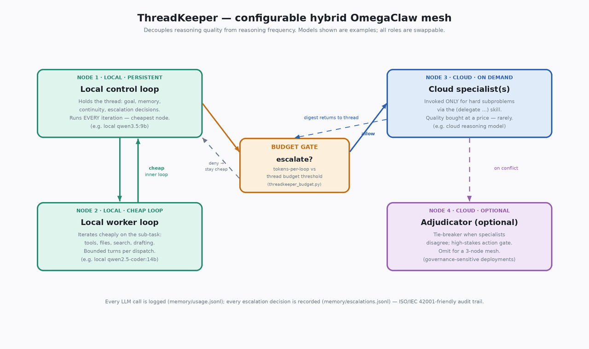

# ThreadKeeper

**A configurable hybrid OmegaClaw architecture for open, decentralized,
budget-aware agent orchestration.**

ThreadKeeper decouples *reasoning quality* from *reasoning frequency*. A
cheap, persistent **local control loop** holds the thread — goal
tracking, memory, continuity, and the decision of *when* hard reasoning
is worth buying. A **local worker loop** iterates cheaply. **Cloud
specialists** are invoked only for the hard subproblems, governed by an
explicit token budget. The result is lower cost, better persistence, no
single-model dependency, and a governance-friendly audit trail — built
as an **extension to [OmegaClaw-Core](https://github.com/asi-alliance/OmegaClaw-Core)**,
not a replacement for it.

> **Hackathon:** BGI Sprint I — track *“Improvements to OmegaClaw.”*
> Team **ThreadKeeper**. See [`HACKATHON.md`](./HACKATHON.md).



---

## The problem: you can't just burn tokens on every loop

A persistent agent loops continuously. The catch is that the two things
it does on each loop have wildly different value:

- **Most loops are cheap bookkeeping** — *what's the goal, what did I
  just learn, what's the next step?* A small model handles these fine.
- **A few loops are genuinely hard** — a subtle inference, a tricky
  synthesis, a high-stakes call. These want a strong model.

Running a frontier model on *every* loop is expensive and unnecessary.
Running a tiny model on the *hard* loops is cheap but unreliable. And
pinning everything to one provider is a cost, availability, and
governance risk. The frequency of reasoning and the quality of reasoning
are different axes — but most agent stacks couple them.

## The solution: ThreadKeeper's four-node mesh

ThreadKeeper separates the two axes by routing them to different nodes.
**The models named below are examples — every role is swappable.** See
[`threadkeeper.config.yaml`](./threadkeeper.config.yaml).

| Node | Role | Runs | Example |
|---|---|---|---|
| **1 · Local control loop** | Holds the thread; owns goal/memory/continuity and the **escalation decision** | every iteration — cheapest node | local small model |
| **2 · Local worker loop** | Iterates cheaply: tools, files, search, drafting | bounded turns per task | local capable model |
| **3 · Cloud specialist(s)** | Hard subproblems only, via `(delegate …)` | on demand — the only premium spend | cloud reasoning model(s) |
| **4 · Adjudicator** *(optional)* | Tie-breaker / high-stakes gate | rarely; omit for a 3-node mesh | cloud model |

Between the control loop and the cloud specialist sits a **budget gate**
([`src/threadkeeper_budget.py`](./src/threadkeeper_budget.py)): it tracks
token usage per loop and decides — against a configurable budget —
whether escalation is justified. Every LLM call is logged
(`memory/usage.jsonl`) and every escalation decision is recorded
(`memory/escalations.jsonl`), giving an ISO/IEC 42001-friendly audit
trail of when expensive reasoning was bought and why.

**The policy itself lives in MeTTa, not Python.** The escalation *decision*
is a set of Atomspace rules in
[`src/escalation.metta`](./src/escalation.metta) (`tk-escalate`), evaluated
through OmegaClaw's own MeTTa runtime (PeTTa). `threadkeeper_budget.py` is the
seam: it supplies live facts (spend, ceiling, soft threshold, local iterations,
hard-flag) and executes the verdict — but the routing logic is symbolic and
**agent-readable / agent-rewritable** via the existing `(read-file ...)` /
`(write-file ...)` skills. This is the same self-modification property
OpenCog Hyperon is built around (see
[`docs/recursive-self-improvement.md`](./docs/recursive-self-improvement.md),
where the agent rewrote its own MeTTa skill). If the MeTTa runtime is
unavailable (e.g. a host/CI without PeTTa), the gate falls back to an identical
set of Python rules — verified by
[`tests/test_escalation_metta_parity.py`](./tests/test_escalation_metta_parity.py),
which checks the MeTTa verdict equals the Python spec across every branch. The
budget *numbers* stay in `threadkeeper.config.yaml`; the `.metta` owns only the
logic.

Full design: **[`docs/architecture.md`](./docs/architecture.md)**.

---

## Why this is an improvement to OmegaClaw *(extension, not correction)*

OmegaClaw-Core is an excellent minimalist neural-symbolic agent: a
persistent MeTTa control loop, a memory store, auditable inference. That
persistent loop is *exactly* the right foundation for ThreadKeeper —
it’s the “thread keeper.” ThreadKeeper adds three things on top and
changes none of OmegaClaw's existing behavior:

1. **Subagent dispatch** — [`src/subagent.py`](./src/subagent.py) + the
   `delegate` skill. A bounded, governed delegation primitive that pairs
   the foundation-model parent with right-sized specialist subagents.
   This is the mechanism the “cloud specialist” node needs. *(Measured,
   in earlier local testing against a 30B local model: ~4.7× input-token
   reduction on tool-heavy delegated workloads. Numbers depend entirely
   on models and workload — treat as illustrative, not a benchmark.)*
2. **A cost-awareness seam** —
   [`src/threadkeeper_budget.py`](./src/threadkeeper_budget.py): token
   accounting and an escalation decision against a budget threshold.
3. **A configuration surface** —
   [`threadkeeper.config.yaml`](./threadkeeper.config.yaml): the
   four-node mesh declared in one place.

An OmegaClaw deployment that ignores all three runs exactly as it does
today. ThreadKeeper is the architecture story — and the budget
discipline — *around* capabilities that slot cleanly into the existing
framework. It is offered in the spirit of the OmegaClaw / SingularityNET
vision: open, decentralized, model-agnostic infrastructure for
autonomous agents.

> **On model choice:** ThreadKeeper makes no claim that any model is
> “better” than another. Its whole point is that the architecture works
> regardless of which models fill each role — that’s what makes it
> open and decentralized.

---

## Quickstart

> ThreadKeeper *is* OmegaClaw-Core plus the three additions above, so
> the base install is identical. The full upstream install/usage/config
> reference is preserved below under **Reference**.

### 1. Install (same as OmegaClaw-Core)

Prerequisites: Git, Python 3, Pip, [venv](https://docs.python.org/3/library/venv.html),
and [SWI-Prolog 9.1.12+](https://www.swi-prolog.org/).

```bash
git clone https://github.com/trueagi-io/PeTTa
cd PeTTa
mkdir -p repos
# Clone THIS repo (ThreadKeeper) into the OmegaClaw-Core slot:
git clone https://github.com/hlgreenblatt/ThreadKeeper.git repos/OmegaClaw-Core
git clone https://github.com/patham9/petta_lib_chromadb.git repos/petta_lib_chromadb
cp repos/OmegaClaw-Core/run.metta ./

python3 -m venv ./.venv && source ./.venv/bin/activate
python3 -m pip install -r ./repos/OmegaClaw-Core/requirements.txt
```

### 2. Set model endpoints & keys via environment variables — never hardcode

ThreadKeeper reads API keys **only** from environment variables named in
the config; it never stores key material in any file. Set the env vars
for whichever providers your mesh uses:

```bash
# Cheap local nodes (control + worker) — example: a local Ollama endpoint
export OLLAMA_API_KEY=ollama           # placeholder; local endpoints often don't auth
export LLM_SERVER_LOCAL_URL=http://localhost:11434

# Cloud specialist — set the key for whatever provider you configured
export ANTHROPIC_API_KEY=sk-...        # example; swap for your provider
```

### 3. Configure the mesh

Edit [`threadkeeper.config.yaml`](./threadkeeper.config.yaml) to point
each node at the models/endpoints you want and to set the budget
threshold. The shipped file is a fully-commented example. Then create a
subagent persona config for the specialist node:

```bash
cp memory/personas-subagent/researcher.json.example \
   memory/personas-subagent/researcher.json
# edit researcher.json: set provider/model/base_url/api_key_env
```

### 4. Run a thread

Start OmegaClaw as usual (the control loop is the thread keeper):

```bash
OMEGACLAW_AUTH_SECRET=<channel-secret> sh run.sh run.metta IRC_channel="<irc-channel>"
```

In the agent's loop, hard subproblems escalate to a specialist via the
`delegate` skill:

```metta
(delegate "find recent papers on Non-Axiomatic Logic and summarize the themes")
```

Inspect the budget state and the current escalation verdict at any time:

```bash
python3 src/threadkeeper_budget.py            # prints spend summary + escalate? verdict
cat memory/usage.jsonl                         # per-call token log
cat memory/escalations.jsonl                   # audit trail of escalation decisions
```

Budget/accounting inputs are treated as local audit/control files: existing
symlinks or non-regular log paths are ignored/fail-closed, usage-log reads are
capped by `THREADKEEPER_MAX_BUDGET_LOG_BYTES` (default 1 MiB), and the local
budget config is read only from a regular non-symlink file capped by
`THREADKEEPER_MAX_BUDGET_CONFIG_BYTES` (default 64 KiB). Size limits are checked
both before and after opening the file, and bounded reads enforce the same caps,
so local growth/swap races do not turn accounting/config checks into unbounded
reads. Usage and escalation audit appends create parent directories
component-by-component without following symlink ancestors, then flush/fsync the
log file and best-effort fsync the parent directory before returning. The MeTTa
escalation policy loader also rejects symlink/non-regular policy paths before
loading, so a malformed local config/log/policy cannot redirect reads/writes or
stall escalation checks.

### What the dashboard numbers mean (honest scope)

The live mesh dashboard (`channels/local.py`) and the budget tracker both read
**one agent's `memory/usage.jsonl`** — they are accurate for *that agent, since
its log began*, and nothing more. Read the tiles with this in mind:

- **Per-agent, not fleet-wide.** Each agent keeps its own `usage.jsonl`. A
  provider's total on the dashboard is that agent's lifetime usage, not your
  account's total spend across every agent or direct API call. To get a
  fleet-wide figure you would aggregate every agent's log (not done here).
- **Tokens are dominated by re-sent context.** A persistent control loop
  re-sends its growing history every iteration, so cumulative *input* tokens
  vastly exceed *output* tokens (e.g. a control model can show millions of
  input tokens against tens of thousands of output). The token count is honest
  but is mostly the same context counted many times — not N distinct jobs.
- **Costs use example rates.** The per-model rates in `channels/local.py` /
  `threadkeeper.config.yaml` are illustrative public figures, not your billed
  pricing. The cost column is a consistent estimate, not an invoice.
- **The savings headline is a counterfactual**, comparing the local-heavy mix
  against an all-frontier build at those same example rates — a relative
  argument for the architecture, not a claim about absolute dollars.

In short: the dashboard answers *"what did **this agent** route where, at
illustrative rates"* — which is exactly the architecture story ThreadKeeper is
making. It is not a billing console.

---

## Reference — OmegaClaw-Core

The sections below are OmegaClaw-Core's own install, usage, and
configuration reference, preserved unchanged. ThreadKeeper does not
alter any of this behavior.

### Meet Oma

Oma is the first Telegram agent built on the OmegaClaw framework.
Interacting with Oma is the fastest way to experience the base
framework. → [Chat on Telegram](https://t.me/ASI_Alliance)

### Overview

OmegaClaw is a neural-symbolic agent framework built on the Hyperon AGI
stack. It unifies large language models with a formal symbolic layer to
create a stateful cognitive architecture capable of auditable inference,
autonomous self-improvement, and long-term persistence. Unlike reactive,
session-based agents, OmegaClaw operates in a continuous execution loop,
managing its own goals and providing auditable proof trails for its
reasoning. The MeTTa-based core is roughly 200 lines of code.

### Usage — LLM provider

Choose your LLM API provider and export the API key as an environment
variable.

| Provider | Env var | Notes |
|---|---|---|
| `Anthropic` (default) | `ANTHROPIC_API_KEY` | Claude models via the Anthropic API. |
| `OpenAI` | `OPENAI_API_KEY` | GPT models (Responses API). |
| `ASICloud` | `ASI_API_KEY` | MiniMax models via ASI Alliance endpoint. |
| `ASIOne` | `ASIONE_API_KEY` | ASI1 model via ASI:One endpoint. |
| `Ollama-local` | `OLLAMA_API_KEY` | Local model; endpoint via `LLM_SERVER_LOCAL_URL`. |
| `OpenRouter` | `OPENROUTER_API_KEY` | GLM model via OpenRouter. |

Run the system from the root folder of PeTTa:

```bash
OMEGACLAW_AUTH_SECRET=<channel-secret> sh run.sh run.metta IRC_channel="<irc-channel>"
```

### Reference — Configuration

| Parameter | Default | Meaning |
|---|---|---|
| `maxNewInputLoops` | 50 | Turns the agent keeps running after a new human message before idling. |
| `maxWakeLoops` | 1 | Extra turns granted on each scheduled wake-up. |
| `sleepInterval` | 1 | Delay between loop iterations (seconds). |
| `wakeupInterval` | 600 | How long idle before the next scheduled wake-up (seconds). |
| `LLM` | `gpt-5.4` | Model identifier passed to the provider. |
| `provider` | `Anthropic` | LLM provider, see table above. |
| `maxOutputToken` | 6000 | Output cap passed to the provider. |
| `reasoningMode` | `medium` | Reasoning-effort hint (OpenAI only). |

Full configuration, memory, and channel tunables live in
[`docs/reference-configuration.md`](./docs/reference-configuration.md).
Full documentation: [`docs/`](./docs/README.md).

ThreadKeeper-specific docs:
- [`docs/architecture.md`](./docs/architecture.md) — the four-node mesh.
- [`docs/reference-skills-subagent.md`](./docs/reference-skills-subagent.md) — the `delegate` skill.
- [`docs/tutorial-09-subagents.md`](./docs/tutorial-09-subagents.md) — end-to-end subagent walkthrough.
- [`docs/recursive-self-improvement.md`](./docs/recursive-self-improvement.md) — **RSI demonstrated**: the agent diagnosed its own failure, designed the fix, had it built, and improved itself — with a human-in-the-loop governor it insisted on. ([full transcript](./docs/xi-interview.md))
- [`docs/disaster-recovery-and-migration.md`](./docs/disaster-recovery-and-migration.md) — memory persistence + cross-provider migration.

---

### Disclaimer

<sub>OmegaClaw is experimental, open-source software developed by SingularityNET Foundation, a Swiss foundation, and distributed and promoted by Superintelligence Alliance Ltd., a Singapore company (collectively, the "Parties"), and is provided "AS IS" and "AS AVAILABLE," without warranty of any kind, express or implied, including but not limited to the implied warranties of merchantability, fitness for a particular purpose, and non-infringement. OmegaClaw is an autonomous AI agent that is designed to independently set goals, make decisions, and take actions (including actions that the user did not specifically request or anticipate) and whose behavior is influenced by large language models provided by third parties, the outputs of which are inherently non-deterministic. Depending on its configuration and the permissions granted to it, OmegaClaw may execute operating-system shell commands, read, write, modify, or delete files, access network resources, send and receive messages through connected communication channels, and modify its own skills, memory, and operational logic at runtime. OmegaClaw may also be susceptible to prompt injection and other adversarial manipulation techniques whereby malicious content embedded in data sources consumed by the agent could influence its behavior in unintended ways. OmegaClaw supports third-party skills and extensions that have not necessarily been reviewed, audited, or endorsed by either of the Parties and that may introduce security vulnerabilities, cause data loss, or result in unintended behavior including data exfiltration. OmegaClaw relies on third-party services, including large language model providers, whose availability, accuracy, cost, and conduct are outside the control of the Parties and whose use is subject to their respective terms, conditions, and privacy policies. The user is solely responsible for configuring appropriate access controls, sandboxing, and permission boundaries, for monitoring, supervising, and constraining OmegaClaw's actions, for ensuring that no sensitive personal data is exposed to the agent without adequate safeguards, and for all actions taken by OmegaClaw on the user's systems or on the user's behalf, including communications sent and files modified. The user is strongly advised to run OmegaClaw in an isolated environment with the minimum permissions necessary for the intended use case. To the maximum extent permitted by applicable law, in no event shall the Parties, their respective board members, directors, contributors, employees, or affiliates be liable for any direct, indirect, incidental, special, consequential, or exemplary damages (including but not limited to damages for loss of data, loss of profits, business interruption, unauthorized transactions, reputational harm, or any damages arising from the autonomous actions taken by OmegaClaw) however caused and on any theory of liability, whether in contract, strict liability, or tort (including negligence or otherwise), even if advised of the possibility of such damages. By downloading, installing, running, or otherwise using OmegaClaw, the user acknowledges that they have read, understood, and agreed to this disclaimer in its entirety. This disclaimer supplements but does not replace the terms of the MIT License under which OmegaClaw is released.</sub>
